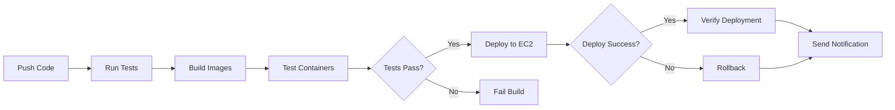

# CI/CD Pipeline Guide for LocateMeAI

This guide explains how to set up continuous integration and continuous deployment for the LocateMeAI application.

## Overview

The CI/CD pipeline automates:
- **Testing**: Runs automated tests on every push
- **Building**: Builds Docker images and validates them
- **Deployment**: Deploys to EC2 on successful builds
- **Rollback**: Automatically rolls back failed deployments
- **Notifications**: Sends deployment status to Slack

## GitHub Actions Workflow

The pipeline is defined in [.github/workflows/deploy.yml](.github/workflows/deploy.yml) and runs on:
- Push to `main` or `production` branches
- Manual trigger via GitHub Actions UI

### Pipeline Stages



## Setup Instructions

### 1. Configure GitHub Secrets

Navigate to: **Repository Settings → Secrets and variables → Actions**

#### Option A: Repository Secrets (Recommended for Single Environment)

Use **Repository secrets** if you have a single deployment environment (e.g., only production).

Click **New repository secret** and add:

**Required Secrets:**
```
EC2_HOST                   # EC2 instance public IP or hostname
EC2_USER                   # SSH user (usually 'ubuntu')
EC2_SSH_KEY                # Private SSH key content (entire .pem file)
```

**Optional Secrets:**
```
AWS_ACCESS_KEY_ID          # (Optional) AWS IAM user access key
AWS_SECRET_ACCESS_KEY      # (Optional) AWS IAM user secret key
AWS_REGION                 # (Optional) e.g., us-east-1

SLACK_WEBHOOK_URL          # (Optional) Slack webhook for notifications
```

> **Note:** AWS credentials are only needed if you plan to use AWS CLI commands in your workflow (e.g., starting/stopping EC2 instances, S3 operations, or CloudWatch logging). The basic deployment workflow uses SSH only and doesn't require AWS credentials.

#### Option B: Environment Secrets (For Multiple Environments)

Use **Environment secrets** if you have multiple deployment environments (staging, production, etc.).

1. Go to **Repository Settings → Environments**
2. Create environments: `production`, `staging`, etc.
3. For each environment, add the secrets with environment-specific values:

**Production Environment:**
```
EC2_HOST → your-production-ec2-ip
EC2_USER → ubuntu
EC2_SSH_KEY → production SSH key
```

**Staging Environment:**
```
EC2_HOST → your-staging-ec2-ip
EC2_USER → ubuntu
EC2_SSH_KEY → staging SSH key
```

Then update the workflow to use environments:
```yaml
deploy:
  environment: production  # or staging
  # ... rest of job
```

**Recommendation:** Start with **Repository secrets** for simplicity. Move to Environment secrets when you need multiple deployment targets.

### 2. Create AWS IAM User (Optional)

> **Note:** This step is only required if you plan to use AWS CLI commands in your workflow for instance management or other AWS operations. The basic SSH-based deployment doesn't require AWS credentials.

If you need AWS API access, create an IAM user with these permissions:
```json
{
  "Version": "2012-10-17",
  "Statement": [
    {
      "Effect": "Allow",
      "Action": [
        "ec2:DescribeInstances",
        "ec2:StartInstances",
        "ec2:StopInstances"
      ],
      "Resource": "*"
    }
  ]
}
```

**Common use cases for AWS credentials:**
- Automatically starting/stopping EC2 instances to save costs
- Uploading artifacts to S3
- Sending logs to CloudWatch
- Managing Auto Scaling groups
- Updating Route53 DNS records

### 3. Configure EC2 Instance

On your EC2 instance:

```bash
# SSH to your EC2 instance
ssh -i your-key.pem ubuntu@your-ec2-ip

# Add GitHub to known hosts
ssh-keyscan github.com >> ~/.ssh/known_hosts

# Initial deployment (for public repos)
cd ~
git clone https://github.com/Kaderbv/LocateMeAI.git
cd LocateMeAI
docker compose up -d --build
```

### 4. Set Up Deploy Keys for Private Repositories (Required for Private Repos)

> **Important:** If your repository is private, you MUST set up a GitHub deploy key before the CI/CD pipeline can clone the repository on EC2.

**Step 1: Generate SSH Key on EC2**

```bash
# SSH to your EC2 instance
ssh -i your-key.pem ubuntu@your-ec2-ip

# Generate SSH key for GitHub
ssh-keygen -t ed25519 -C "ec2-deploy-key" -f ~/.ssh/github_deploy_key -N ""

# Display the public key
cat ~/.ssh/github_deploy_key.pub
```

**Step 2: Add Deploy Key to GitHub**

1. Copy the public key output from the previous command
2. Go to your repository on GitHub: https://github.com/Kaderbv/LocateMeAI/settings/keys
3. Click **"Add deploy key"**
4. **Title:** `EC2 Deployment Key`
5. **Key:** Paste the public key
6. ✅ **Check "Allow write access"** (required for pulling updates)
7. Click **"Add key"**

**Step 3: Configure SSH to Use the Deploy Key**

```bash
# On EC2 instance, create/edit SSH config
cat >> ~/.ssh/config << 'EOF'
Host github.com
    HostName github.com
    User git
    IdentityFile ~/.ssh/github_deploy_key
    StrictHostKeyChecking no
EOF

chmod 600 ~/.ssh/config

# Test the connection
ssh -T git@github.com
```

**Expected Output:**
```
Hi Kaderbv/LocateMeAI! You've successfully authenticated, but GitHub does not provide shell access.
```

This message confirms authentication is working correctly. The workflow will now be able to clone and pull from your private repository.

**Step 4: Clone Repository Using SSH (for private repos)**

```bash
# Clone using SSH URL
cd ~
git clone git@github.com:Kaderbv/LocateMeAI.git
cd LocateMeAI
docker compose up -d --build
```

**Troubleshooting:**
- If `ssh -T git@github.com` fails, check that the public key was added correctly to GitHub
- Ensure "Allow write access" is checked on the deploy key
- Verify the SSH key file has correct permissions: `chmod 600 ~/.ssh/github_deploy_key`

## Manual Deployment

### Deploy from Local Machine

**Prerequisites:**
- Your EC2 SSH private key (`.pem` file) downloaded from AWS
- Key stored securely on your local machine (e.g., `~/.ssh/your-key.pem`)

**On Linux/Mac:**
```bash
# Set proper permissions on your SSH key (required)
chmod 600 ~/.ssh/your-key.pem

# Set environment variables
export EC2_HOST="your-ec2-ip"
export EC2_USER="ubuntu"
export EC2_KEY_PATH="~/.ssh/your-key.pem"  # Path to your local SSH key

# Deploy
ssh -i $EC2_KEY_PATH $EC2_USER@$EC2_HOST << 'EOF'
  cd ~/LocateMeAI
  git pull origin main
  docker compose down
  docker compose up -d --build
EOF
```

**On Windows (PowerShell):**
```powershell
# Set environment variables
$env:EC2_HOST = "your-ec2-ip"
$env:EC2_USER = "ubuntu"
$env:EC2_KEY_PATH = "C:\Users\YourUsername\.ssh\your-key.pem"  # Path to your local SSH key

# Deploy using ssh
ssh -i $env:EC2_KEY_PATH $env:EC2_USER@$env:EC2_HOST "cd ~/LocateMeAI && git pull origin main && docker compose down && docker compose up -d --build"
```

> **Note:** `EC2_KEY_PATH` is the local file path on your computer where you saved the SSH key downloaded from AWS. This is different from `EC2_SSH_KEY` secret in GitHub Actions, which contains the key content itself.

### Deploy Using GitHub Actions UI

1. Go to your repository on GitHub
2. Click **Actions** tab
3. Select **Deploy to EC2** workflow
4. Click **Run workflow**
5. Choose the branch and click **Run workflow**

## Deployment Verification

After deployment, verify:

```bash
# Check container status
docker compose ps

# Check backend health
curl http://localhost:8000/

# View logs
docker compose logs -f

# Check resource usage
docker stats
```

## Rollback Procedures

### Automatic Rollback

The pipeline automatically rolls back on deployment failure.

### Manual Rollback

```bash
# SSH to EC2
ssh -i your-key.pem ubuntu@your-ec2-ip

# Rollback to previous commit
cd ~/LocateMeAI
git log --oneline -5  # View recent commits
git reset --hard <previous-commit-hash>

# Redeploy
docker compose down
docker compose up -d --build
```

### Rollback to Specific Version

```bash
# On EC2
cd ~/LocateMeAI
git fetch --all
git checkout <tag-or-commit>
docker compose down
docker compose up -d --build
```

## Best Practices

### 1. Use Feature Branches

```bash
# Create feature branch
git checkout -b feature/new-feature

# Push and create PR
git push origin feature/new-feature
```

### 2. Tag Releases

```bash
# Create release tag
git tag -a v1.0.0 -m "Release version 1.0.0"
git push origin v1.0.0
```

### 3. Environment-Specific Deployments

Modify the workflow to deploy to different environments:

```yaml
jobs:
  deploy-staging:
    if: github.ref == 'refs/heads/develop'
    env:
      EC2_HOST: ${{ secrets.STAGING_EC2_HOST }}
  
  deploy-production:
    if: github.ref == 'refs/heads/main'
    env:
      EC2_HOST: ${{ secrets.PRODUCTION_EC2_HOST }}
```

### 4. Blue-Green Deployment

For zero-downtime deployments:

```bash
# Start new version on different ports
docker compose -p locatemeai-green up -d

# Test the green environment
curl http://localhost:8502

# Switch traffic (update load balancer or nginx)
# Then remove old version
docker compose -p locatemeai-blue down
```

## Monitoring Deployments

### View Deployment History

```bash
# On EC2
cd ~/LocateMeAI
git log --oneline --graph --all -20
```

### Check Deployment Logs

```bash
# Application logs
docker compose logs -f --tail=100

# System logs
journalctl -u docker -f
```

### Deployment Metrics

Track these metrics:
- Deployment frequency
- Lead time for changes
- Mean time to recovery (MTTR)
- Change failure rate

## Troubleshooting

### Pipeline Fails at Test Stage

```bash
# Run tests locally
cd backend
python -m pytest tests/

cd ../frontend
python -m pytest tests/
```

### Deployment Timeout

Increase timeout in workflow:
```yaml
timeout-minutes: 30
```

### SSH Connection Issues

```bash
# Test SSH connection
ssh -v -i your-key.pem ubuntu@your-ec2-ip

# Check security group rules
# Ensure port 22 is open for GitHub Actions IPs
```

### Docker Build Failures

```bash
# On EC2, rebuild manually with verbose output
docker compose build --no-cache --progress=plain

# Check disk space
df -h
docker system df
```

## Advanced Configuration

### Add Automated Tests

Create test files:
```
backend/tests/test_api.py
frontend/tests/test_ui.py
```

Update workflow to run tests:
```yaml
- name: Run tests
  run: |
    cd backend
    pytest tests/
```

### Add Code Quality Checks

```yaml
- name: Run linting
  run: |
    pip install flake8 black
    flake8 .
    black --check .
```

### Add Security Scanning

```yaml
- name: Security scan
  uses: aquasecurity/trivy-action@master
  with:
    image-ref: 'locatemeai-backend:latest'
    format: 'sarif'
```

## Slack Notifications

Configure Slack webhook:

1. Go to Slack → Apps → Incoming Webhooks
2. Create new webhook
3. Add webhook URL to GitHub secrets
4. Customize notification format in workflow

## Cost Considerations

- GitHub Actions: 2,000 free minutes/month for private repos
- Consider self-hosted runners for unlimited builds
- Optimize build times to reduce costs

## Support

For issues with CI/CD:
1. Check [GitHub Actions logs](https://github.com/Kaderbv/LocateMeAI/actions)
2. Review deployment logs on EC2
3. Open an issue on GitHub

## Additional Resources

- [GitHub Actions Documentation](https://docs.github.com/en/actions)
- [Docker Compose Documentation](https://docs.docker.com/compose/)
- [AWS EC2 Documentation](https://docs.aws.amazon.com/ec2/)
