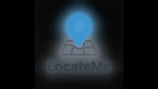
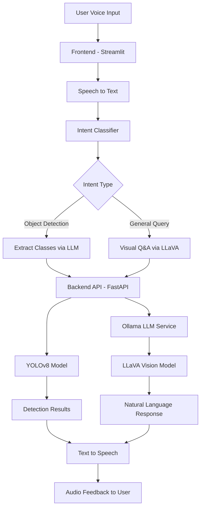

# LocateMe AI

A Voice-based virtual assistant integrating AI-powered vision, transforming how we locate misplaced items like phones, keys, and glasses.

## 🎬 Demo Video

Click the below icon to watch a demo on how to use this repo

[](https://youtu.be/ajYJBCN4RpA)

## Login Credentials
Add a lightweight username/password gate for a small set of users

 - Username : alice
  
    Password : password123

  - Username : bob
     
    Password : password456
## 🎯 Project Overview

LocateMe AI is a voice-assisted object detection application that uses YOLOv8 to identify objects in uploaded images. Users can interact with the system through voice commands, making it accessible and intuitive.

## ✨ Features

- 🎤 **Voice Commands**: Control the application using natural language voice commands
- 🧠 **AI-Powered Intent Classification**: Automatically detects whether to perform object detection or answer general questions
- 🤖 **LLM Integration**: Uses Ollama with LLaVA model for natural language understanding and visual question answering
- 👁️ **Object Detection**: Powered by YOLOv8 for accurate real-time object detection
- 🎯 **Smart Object Filtering**: Specify objects to detect (e.g., "find person and car") using natural language
- � **Model Fine-tuning**: Train custom YOLO models on your own datasets
- 📦 **Model Management**: Switch between default and custom-trained models
- �🎥 **Video Detection**: Process videos with frame-by-frame object detection
- 📍 **Frame-Level Tracking**: See which specific frames contain detected objects
- 🔊 **Text-to-Speech**: Audio feedback for detection results
- 📸 **Image Upload**: Support for JPG, JPEG, and PNG formats
- 🎬 **Video Upload**: Support for MP4, AVI, and MOV formats
- 📊 **Detection Statistics**: Comprehensive summary with object names, class IDs, and frame numbers
- 📥 **Download Results**: Download processed videos with bounding boxes
- 🎨 **Modern UI**: Clean Streamlit interface with custom styling
- 🔐 **Optional Frontend Login**: Add a lightweight username/password gate for a small set of users
- 🐳 **Docker Support**: Easy deployment with Docker Compose

## 🏗️ Architecture

### System Design



### Project Structure

```
LocateMeAI/
├── frontend/                    # Streamlit web interface
│   ├── app.py                  # Main Streamlit application
│   ├── locate_image.py         # Image detection module
│   ├── locate_video.py         # Video detection module
│   ├── fine_tuning.py          # Model fine-tuning interface
│   ├── general_inquiry.py      # LLM-based Q&A module
│   ├── user_intent_classify.py # Intent classification
│   ├── speechtotext.py         # Voice recognition module
│   ├── texttospeech.py         # Audio feedback module
│   ├── config.py               # Frontend configuration
│   ├── utils/
│   │   ├── image_utils.py      # Image processing utilities
│   │   └── video_utils.py      # Video processing utilities
│   ├── Dockerfile              # Frontend container config
│   └── requirements.txt
├── backend/                     # FastAPI server
│   ├── app/
│   │   ├── main.py             # FastAPI endpoints
│   │   ├── yolo_model.py       # YOLO model wrapper
│   │   ├── finetune_utils.py   # Fine-tuning utilities
│   │   ├── ollma_llm.py        # Ollama LLM integration
│   │   ├── intent_classifier.py # Intent classification
│   │   ├── coco_classes.py     # COCO class mappings
│   │   ├── utils.py            # Detection utilities
│   │   └── config.py           # Backend configuration
│   ├── Dockerfile              # Backend container config
│   ├── yolov8n.pt              # YOLO model weights
│   └── requirements.txt
├── sample_finetuning_dataset/   # Sample dataset for fine-tuning
│   ├── README.md               # Dataset documentation
│   ├── INSTRUCTIONS.md         # How to create images
│   ├── ANNOTATION_FORMAT.md    # YOLO format reference
│   ├── validate_annotations.py # Validation script
│   └── sample_image_*.txt      # Sample annotations
├── .env.example                 # Environment variables template
├── .env                         # Local environment configuration
├── docker-compose.yml           # Docker orchestration
├── DEPLOYMENT.md                # Deployment guide
├── FINETUNING-GUIDE.md          # Fine-tuning comprehensive guide
├── assets/                      # Logo and static files
├── SampleImages/                # Sample test images
└── SampleVideos/                # Sample test videos
```

### Technology Stack

**Frontend Layer:**
- **Streamlit**: Web UI framework
- **SpeechRecognition**: Voice input processing
- **gTTS + Pygame**: Text-to-speech output

**Backend Layer:**
- **FastAPI**: REST API server
- **Ultralytics YOLOv8**: Object detection
- **OpenCV**: Video/image processing

**AI/ML Layer:**
- **YOLOv8n**: Lightweight object detection model (80 COCO classes)
- **Ollama + LLaVA**: Vision-language model for Q&A
- **Sentence Transformers**: Intent classification

**Infrastructure:**
- **Docker**: Containerization
- **Python 3.11**: Runtime environment

## 🚀 Getting Started

### Prerequisites

**For Local Development:**
- Python 3.8+
- pip package manager
- Microphone for voice commands
- [Ollama](https://ollama.ai/) installed and running locally
- LLaVA model pulled in Ollama: `ollama pull llava`

**For Docker Deployment:**
- Docker Engine 20.10+
- Docker Compose 2.0+
- 8GB+ RAM recommended
- Ollama running on host machine (for LLM features)

### Installation

#### Option 1: Local Development Setup

1. **Clone the repository**
   ```bash
   git clone https://github.com/Kaderbv/LocateMeAI.git
   cd LocateMeAI
   ```

2. **Install and configure Ollama**
   ```bash
   # Download and install from https://ollama.ai/
   
   # Pull the LLaVA model
   ollama pull llava
   
   # Verify Ollama is running
   ollama list
   ```

3. **Configure environment variables**
   ```bash
   # Copy the example environment file
   cp .env.example .env
   
   # Edit .env to configure settings (optional)
   # Default model is llava, change OLLAMA_MODEL_NAME if needed
   ```

4. **Set up the backend**
   ```bash
   cd .\backend\
   python -m venv venv // (optional / for the first time) 
   .\venv\Scripts\activate
   pip install -r requirements.txt
   uvicorn app.main:app --reload
   ```

5. **Set up the frontend**
   ```bash
   cd .\frontend\
   python -m venv venv // (optional / for the first time)
   .\venv\Scripts\activate
   pip install -r requirements.txt
   .\venv\Scripts\python.exe -m streamlit run app.py
   ```

#### Optional: Enable simple frontend authentication

If you only need to protect the Streamlit UI for a few known users, you can enable the built-in lightweight login gate.

Add these variables in `frontend/.env.local` for local development or `frontend/.env` for Docker:

```env
FRONTEND_AUTH_ENABLED=true
FRONTEND_AUTH_USERS=alice:change-me,bob:change-me-too
```

Notes:
- This is intended for a small fixed user list.
- Passwords are stored in environment variables, so this is best for internal or low-risk deployments.
- For public internet exposure, prefer a proper identity provider or reverse-proxy auth.

#### Option 2: Docker Setup (Recommended for Production)

See the [Docker Deployment](#-docker-deployment) section below.

### Running the Application

1. **Start the backend server**
   ```bash
   cd backend
   python -m venv venv // (optional / for the first time)
   .\venv\Scripts\activate
   pip install -r requirements.txt
   uvicorn app.main:app --reload
   ```
   The API will be available at `http://localhost:8000`

2. **Start the frontend** (in a new terminal)
   ```bash
   cd frontend
   python -m venv venv // (optional / for the first time)
   .\venv\Scripts\activate
   pip install -r requirements.txt
   .\venv\Scripts\python.exe -m streamlit run app.py
   ```
   The UI will open automatically at `http://localhost:8501`

## 📖 Usage

### Image Detection

1. **Navigate to Image Tab**: Select "Locate by Image" in the sidebar
2. **Upload an Image**: Click "Browse files" to upload an image (JPG, JPEG, PNG)
3. **Voice Command**: Click "Start Voice Command" and say:
   - **Object Detection Mode**:
     - "detect objects" - Detects all objects
     - "find person and car" - Detects specific objects
     - "locate dog" - Detects only dogs
   - **General Query Mode**:
     - "what's in this image?"
     - "describe the scene"
     - "what color is the car?"
     - "how many people are there?"
4. **View Results**: 
   - **Object Detection**: See bounding boxes, object names, class IDs, and confidence scores
   - **General Query**: Receive AI-generated natural language answers

### Video Detection

1. **Navigate to Video Tab**: Select "Locate by Video" in the sidebar
2. **Upload a Video**: Click "Browse files" to upload a video (MP4, AVI, MOV)
3. **Voice Command**: Click "Start Voice Command for Video" and say:
   - **Object Detection Mode**:
     - "detect objects" - Detects all objects in video
     - "find person and bicycle" - Tracks specific objects
     - "track cars" - Follows cars through frames
   - **General Query Mode**:
     - "what's happening in this video?"
     - "describe the activity"
     - "summarize the video"
4. **View Results**: 
   - See detection statistics with:
     - Object names (e.g., "person", "car")
     - Class IDs (e.g., "0,2")
     - Frame numbers where each object appears
     - Total detection count per object
   - Watch the processed video with bounding boxes
   - Download the annotated video

## 🛠️ Technologies Used

- **Frontend**: Streamlit, SpeechRecognition, gTTS, Pygame, Requests
- **Backend**: FastAPI, Ultralytics YOLOv8, OpenCV, Pillow
- **AI/ML Models**: 
  - YOLOv8n (nano) for object detection
  - LLaVA (via Ollama) for visual question answering
  - Sentence Transformers for intent classification
- **Infrastructure**: Docker, Docker Compose
- **Configuration**: Python-dotenv for environment management
- **Audio**: Pygame for audio playback, SpeechRecognition for voice input

## 📦 Dependencies

### Frontend
```txt
streamlit>=1.28.0
requests>=2.31.0
speechrecognition>=3.10.0
pygame>=2.5.2
gtts>=2.4.0
pyaudio>=0.2.13
python-dotenv>=1.0.0
```

### Backend
```txt
fastapi>=0.104.0
ultralytics>=8.0.200
python-multipart>=0.0.6
uvicorn>=0.24.0
opencv-python>=4.8.0
Pillow>=10.1.0
sentence-transformers>=2.2.2
python-dotenv>=1.0.0
torch>=2.1.0
```

## 🔧 API Endpoints

### Core Detection Endpoints

#### `POST /detect`
Detects objects in an uploaded image with optional class filtering.

**Request:**
```bash
curl -X POST "http://localhost:8000/detect" \
  -F "file=@image.jpg" \
  -F "classes=0,2,16"  # Optional: person, car, dog
```

**Request Parameters:**
- `file` (required): Image file (JPG, JPEG, PNG)
- `classes` (optional): Comma-separated class IDs to filter (e.g., "0,2,16")

**Response:**
```json
{
  "detections": [
    {
      "label": "person",
      "confidence": 0.95,
      "class_id": 0,
      "bbox": [100, 150, 200, 400]
    },
    {
      "label": "car",
      "confidence": 0.89,
      "class_id": 2,
      "bbox": [300, 200, 500, 450]
    }
  ]
}
```

#### `POST /detect-video`
Processes video with frame-by-frame object detection and returns annotated video.

**Request:**
```bash
curl -X POST "http://localhost:8000/detect-video" \
  -F "file=@video.mp4" \
  -F "classes=0,1"  # Optional: person, bicycle
```

**Request Parameters:**
- `file` (required): Video file (MP4, AVI, MOV)
- `classes` (optional): Comma-separated class IDs to filter

**Response:**
```json
{
  "message": "Video processed successfully",
  "output_file": "abc123_output.mp4",
  "total_frames": 150,
  "detections": [
    {
      "label": "person",
      "confidence": 0.92,
      "class_id": 0,
      "frame_id": 1,
      "bbox": [120, 180, 250, 420]
    },
    {
      "label": "person",
      "confidence": 0.88,
      "class_id": 0,
      "frame_id": 3,
      "bbox": [125, 185, 255, 425]
    },
    {
      "label": "bicycle",
      "confidence": 0.85,
      "class_id": 1,
      "frame_id": 5,
      "bbox": [300, 250, 450, 400]
    }
  ]
}
```

#### `GET /download-video/{filename}`
Downloads processed video with detection annotations.

**Request:**
```bash
curl -O "http://localhost:8000/download-video/abc123_output.mp4"
```

**Response:** Video file (MP4) with bounding boxes drawn on detected objects

---

### AI-Powered Endpoints

#### `POST /extract-classes`
Extracts COCO class IDs and object names from natural language commands using LLM.

**Request:**
```bash
curl -X POST "http://localhost:8000/extract-classes" \
  -F "command=find person and car in the image"
```

**Request Parameters:**
- `command` (required): Natural language detection command

**Response:**
```json
{
  "class_ids": "0,2",
  "object_names": ["person", "car"]
}
```

**Example Commands:**
- "detect people and cars" → `{"class_ids": "0,2", "object_names": ["person", "car"]}`
- "find dogs and cats" → `{"class_ids": "16,15", "object_names": ["dog", "cat"]}`
- "detect all objects" → `{"class_ids": "", "object_names": []}`

#### `POST /classify-intent`
Classifies user intent as "object_detection" or "general_inquiry".

**Request:**
```bash
curl -X POST "http://localhost:8000/classify-intent" \
  -F "text=what's in this image?"
```

**Request Parameters:**
- `text` (required): User's natural language query

**Response:**
```json
{
  "intent": "general_inquiry"
}
```

**Intent Classification:**
- `object_detection`: "find person", "detect cars", "locate dog"
- `general_inquiry`: "what's in this image?", "describe the scene", "what color is the car?"

#### `POST /ask-general-query`
Handles general questions about images or videos using LLaVA vision-language model.

**Request:**
```bash
curl -X POST "http://localhost:8000/ask-general-query" \
  -F "file=@image.jpg" \
  -F "question=What is the person doing?" \
  -F "isImage=true"
```

**Request Parameters:**
- `file` (required): Image or video file
- `question` (required): Natural language question
- `isImage` (required): "true" for images, "false" for videos

**Response:**
```json
{
  "response": "The person in the image is walking a dog in a park. They appear to be wearing casual clothing and the scene looks like it's during daytime with clear weather."
}
```

**Video Response Example:**
```json
{
  "response": "Frame 0: The video shows a person entering a room.\n\nFrame 45: The person is now sitting at a desk working on a computer.\n\nFrame 90: The person stands up and exits the room."
}
```

---

### Health Check

#### `GET /`
Checks if the API is running.

**Request:**
```bash
curl "http://localhost:8000/"
```

**Response:**
```json
{
  "message": "YOLO Object Detection API is running."
}
```

## 🐳 Docker Deployment

### Quick Start with Docker Compose

1. **Ensure Ollama is running on host machine**
   ```bash
   # Ollama must be running on your host machine
   ollama serve
   
   # Pull the LLaVA model if not already done
   ollama pull llava
   ```

2. **Build and start all services**
   ```bash
   # From the project root directory
   docker-compose up --build
   ```

3. **Access the application**
   - Frontend UI: http://localhost:8501
   - Backend API: http://localhost:8000
   - API Docs: http://localhost:8000/docs

### Docker Architecture

```yaml
services:
  backend:     # FastAPI + YOLOv8
    - Port: 8000
    - Volumes: ./backend/uploads, ./backend/outputs
    - Network: locatemeai-network
    
  frontend:    # Streamlit UI
    - Port: 8501
    - Depends on: backend
    - Network: locatemeai-network
    
  # Ollama runs on host machine
  # Access via: http://host.docker.internal:11434
```

### Docker Commands

**Start services (detached mode):**
```bash
docker-compose up -d
```

**View logs:**
```bash
# All services
docker-compose logs -f

# Specific service
docker-compose logs -f backend
docker-compose logs -f frontend
```

**Stop services:**
```bash
docker-compose down
```

**Rebuild after code changes:**
```bash
docker-compose up --build
```

**Clean up (remove volumes):**
```bash
docker-compose down -v
```

### Environment Configuration for Docker

The application uses environment variables defined in `.env` file:

```env
# Backend Configuration (Docker)
BACKEND_HOST=0.0.0.0
BACKEND_PORT=8000
BACKEND_URL=http://backend:8000

# Frontend Configuration (Docker)
FRONTEND_HOST=0.0.0.0
FRONTEND_PORT=8501

# Ollama Configuration (Host Machine)
OLLAMA_HOST=http://host.docker.internal:11434
OLLAMA_MODEL_NAME=llava

# Model Configuration
DEFAULT_YOLO_MODEL=yolov8n.pt
```

### Running Ollama in Docker (Optional)

If you want to run Ollama inside Docker, uncomment the ollama service in `docker-compose.yml`:

```yaml
ollama:
  image: ollama/ollama:latest
  container_name: locatemeai-ollama
  ports:
    - "11434:11434"
  volumes:
    - ollama-data:/root/.ollama
  networks:
    - locatemeai-network
  restart: unless-stopped
```

Then update `.env`:
```env
OLLAMA_HOST=http://ollama:11434
```

### Troubleshooting Docker

**Issue: Backend can't connect to Ollama**
```bash
# Verify Ollama is accessible from host
curl http://localhost:11434/api/tags

# Check if containers can reach host
docker exec locatemeai-backend curl http://host.docker.internal:11434/api/tags
```

**Issue: Frontend can't connect to backend**
```bash
# Check if backend is healthy
docker exec locatemeai-frontend curl http://backend:8000/

# Verify network connectivity
docker network inspect locatemeai-network
```

**Issue: Out of disk space**
```bash
# Remove unused images and volumes
docker system prune -a --volumes
```

### Production Deployment

For production deployment, consider:

1. **Use production-grade WSGI server:**
   ```dockerfile
   CMD ["gunicorn", "app.main:app", "-w", "4", "-k", "uvicorn.workers.UvicornWorker", "--bind", "0.0.0.0:8000"]
   ```

2. **Add reverse proxy (Nginx):**
   - SSL/TLS termination
   - Load balancing
   - Static file serving

3. **Configure resource limits:**
   ```yaml
   deploy:
     resources:
       limits:
         cpus: '2'
         memory: 4G
   ```

4. **Set up monitoring:**
   - Health checks
   - Log aggregation
   - Performance monitoring

5. **Use secrets management:**
   - Don't commit `.env` to version control
   - Use Docker secrets or environment-specific configs

See [DEPLOYMENT.md](DEPLOYMENT.md) for detailed production deployment guide.

## 🎯 Future Enhancements

- Real-time camera detection
- Live video streaming support
- Multi-language support
- Custom object training
- Mobile application
- Location history tracking
- Cloud deployment

## 👥 Contributors

Capstone Project - Uplevel Program

## 📄 License

This project is for educational purposes.

## 🤝 Acknowledgments

- YOLOv8 by Ultralytics
- Streamlit framework
- FastAPI framework
